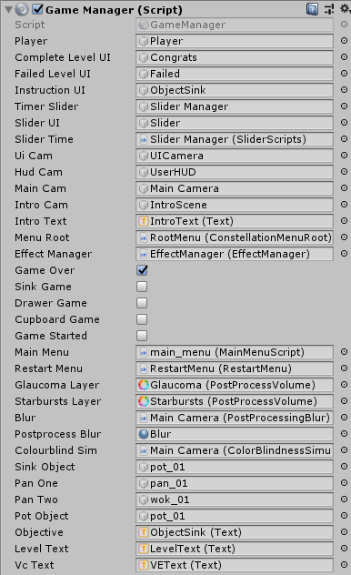
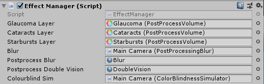
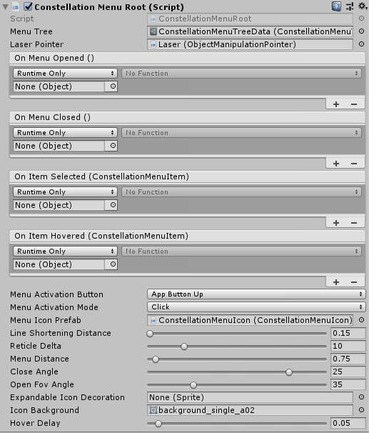
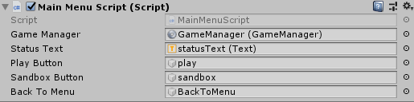
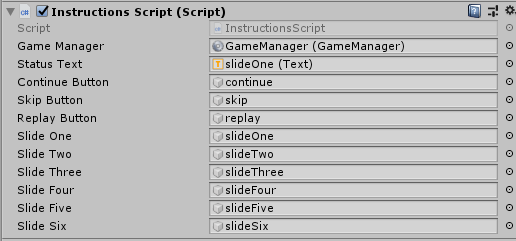
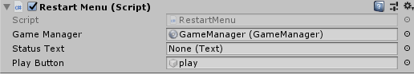
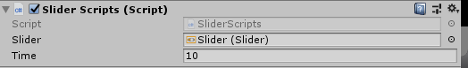
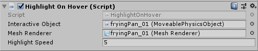
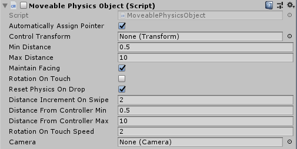
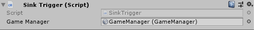

# BlindToilets
**Plan**
- Make a VR game which incorporates the player doing a simple task, and then having to do the same task, while visually impaired.
- The idea of the app is to give awareness of different types of visual impairments and to show how difficult simple tasks can be for different people.

### Update Log
https://jamesgrigg.github.io/Project1Portfolio/

## Production
This project runs on the most up-to-date version of Unity as of June 2019 (2019.1.7), so should run on at least that version to ensure the best possible performance. An Android SDK and Java JDK are both required to install the project onto a mobile device, and can be installed through Unity.

## Usage
This application is designed to run on a mobile device along side a Google Daydream VR Headset (with the controller). This also requires a "Daydream Ready Mobile Device" (see https://vr.google.com/daydream/smartphonevr/phones/ for a list of Daydream ready phones). The application was created in Untiy. Once installed onto the phone and opened, the user is put into the kitchen scene. They are able to interact with the environment using the Daydream controller. Instructions are provided in game on the exact controls. The user can look around by moving their head around in VR, and they are able to either play a game or enter a sandbox mode where there is no objectives and can just play with the environment and visual conditions.

## Main Issues
Shader Performance: Due to this running in VR, we almost require the app to run at 60fps to help reduce motion sickness in the app. Unfortunately, VR is already expensive to run on the phone, and to get the desired visual conditon into the game, I have had to user some shaders. Shaders do not run well on mobile devices, and running a couple of the visual conditions can cause some performance issues (around 40fps gameplay can occur), which can be noticable. This mainly just happens with Cataracts and sometimes Starbursts.

Menu Art: I am not an artist and have not implemented any designs onto the Constellation menu system for each of the options. They currently just use the default images that come with Daydream Elements, as I was too lazy to create new ones.

File Size: Due to me using Daydream Elements, the project is rather large. I tried changing it from Mono development due to being on mobile, but it caused a lot of issues so this can be something to fix in the future. Also removing someof the extra things (such as models) that Daydream Elements introduces will defintely help with file size.

## Scripts Used
To get some of they key things working in this app, I was required to write some custom scripts. Below are the Unity screenshots of the scripts, along with a description on what they do.

### Game Manager
The Game Manager script is the most important script in the whole project. It controls basically everything. It controls the game and how the game runs (however, I could put the game into its own script file to clean it up a little), it controls the visual conditions, it controls the objects in the scene, the UI, the HUD and the different cameras in the scene.

### Effect Manager
The Effect Manager controls how the different visual conditions are changed when in game. You are able to control the different 'weight' values of the visual conditions. This script controls how much the visual condition is changed when selecting the different levels for the visual condtions. This script would be used if you wanted to add sliders into the game for controlling the visual condition potency.

### Constellation Menu
This script is a script that comes with Daydream Elements, however I am including it here as ther is minimal official documentation on it. Essentially, this controls the buttons and scripts used with the constellation menu. You add in your base root menu as the 'menu tree', and then add to that menu tree outside of this script. This script also controls which buttons control what in the menu. You are also able to change where the menu sits in 3D space to help with usability.

### Main Menu
This script controls the main menu that is present when you start the game. It has a 'Play' button and 'Sandbox' button that it controls, as well as a 'Back to Menu' button. It also controls the text that is displayed on the menu in case it is needed to be changed. The 'Play' button controls the start of the game, the 'Sandbox' button controls the ability to enter the sandbox mode where you don't have any objective, and the 'Back to Menu' button controls the ability to reset the game when you want to exit the sandbox mode. All of these buttons influence the Game Manager, hence why the script passes in the Game Manager script.

### Instruction Menu
This script controls the instruction menu that is constantly on display on the Eastern wall. I have it setup so that each set of instructions is a different Text element, as then I was able to easily see how it looked on the wall, however in the future this could be changed to just 1 Text element that is updated on each slide. Either way it will work the same way, this way just allows for more customisation. If I find that people struggle with the game, I will think about updating it so that the user has to read through all of the instructions (or click skip) before they can play to ensure they know how to play.

### Restart Menu
This script controls the ability to restart the game upon completing/failing the game. This script is essentially the same as the 'Play' button script from the Main Menu Script, and to reduce scripts you could combine the 2, however this way it is cleaner for layout.

### Slider Scripts
This script controls the timer that is displayed on the wall when the game is active. It controls how much time the timer has before it finishes, and this time can be changed through using the Time variable. I have changed the time value in the Game Manager for the different levels.

### Highlight on Hover
This script is also from Daydream Elements, however it is a nice script to include into this game. It add a nice animated hover effect when hovering over items. This script controls the colour that the object will change to when highlighted, the speed in which the animation occurs and the object that is affected.

### Movable Physics
This script comes from Daydream Elements, and is used to control the objects that need to be moved. It is used for controlling how the user interacts with the objects in the world. It also allows for objects to be reset when dropping them, which is very useful if you want the obejcts the land the right way up. This script just makes controlling objects a lot more user friendly.

### Post Processing
This is an example of the post processing effects I use for a couple of the visual conditions. To apply these, you add a Post Processing Volume script to the scene, which comes in the Unity plugin 'Post Processing Stack'. This script is important for getting the effects to look how you want, and the most important part of the Post Process Volume is the 'weight' value. This controls the opacity essentially of the effect. From there, you just need to choose your effects that you want to add, and then customise them to be exactly what you want them to look like. Quite simple.

### Sink Trigger
This script controls the triggers used in the sink. There are 2 other scripts almost identical to this for the cupboard and the drawer, however I have chosen not to include screenshots of these as they work the same way. These scripts just check which level of the game you are onto, then either activate or deactivate the triggers so that the Game Manager can see if you have completed the game objective. The drawer trigger script checks to see if certain objects have gone into it, otherwise when you try and close the drawer, the drawers itself will cause a false positive reading for the trigger. That is just something to consider when developing with moving triggers.

